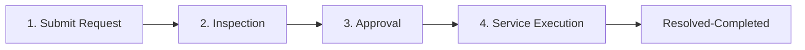

# Vehicle Service Management Application 🚗🔧


An enterprise-grade **Vehicle Service Management Application** developed on **Pega Infinity ('25.1.3)** as part of the **National Internship Program (NIP)** for UrbanFleet Operations.

## 📌 Project Overview
The Vehicle Service Management Application automates the complete lifecycle of vehicle maintenance inquiries, inspection, cost estimation, customer approval, technician assignment, and service resolution.

* **Application Name:** `Vehicle Service Management`
* **Case Type:** `Vehicle Service Request`
* **Organization Layer:** `UrbanFleetNIP` / `VFleet`
* **Operator:** `author@uplus`
* **Live Demo URL:** [Pega Academy Instance](https://gifdvsmv.pegaacademy.net/prweb/app/vehicle-service-management/)

---

## 🚀 Key Features & User Stories (US-001 to US-010)

| User Story | Title | Implementation Summary | Evidence Screenshot |
| :--- | :--- | :--- | :--- |
| **US-001** | Submit Vehicle Request | Form capturing `Vehicle ID`, `Vehicle Model`, and `Issue Description` with mandatory field validations. | [View Screenshot](screenshots/US-001_Submit_Request.png) |
| **US-002** | Perform Inspection | Service Advisor records `Inspection Notes` and mandatory `Condition Rating` (Good, Fair, Poor). | [View Screenshot](screenshots/US-002_Perform_Inspection.png) |
| **US-003** | Generate Service Estimate | Captures `Labor Cost` and `Parts Cost` with an expression rule automatically calculating `Total Cost` (`.LaborCost + .PartsCost`). | [View Screenshot](screenshots/US-003_Generate_Estimate.png) |
| **US-004** | Approve Service Estimate | Approval step assigned to `Customer` persona with `Approve` and `Reject` decision branching. | [View Screenshot](screenshots/US-004_Approve_Estimate.png) |
| **US-005** | Maintain Vehicle Data | Reusable `Vehicle` Data Object containing properties: `Vehicle ID`, `Model`, and `Type`. | [View Screenshot](screenshots/US-005_Vehicle_Data_Object.png) |
| **US-006** | Review Service Estimate | Form presenting cost breakdown (`Labor Cost`, `Parts Cost`, `Total Cost`) in **Read-only** format before decision. | [View Screenshot](screenshots/US-006_Review_Cost_Breakdown.png) |
| **US-007** | Auto Assign Technician | Automated queue routing assigning execution tasks to technician work queues based on vehicle profile. | [View Screenshot](screenshots/US-007_Auto_Assign_Technician.png) |
| **US-008** | Notify Service Completion | Automated `Send Email` correspondence step triggering on resolution with case summary. | [View Screenshot](screenshots/US-008_Notify_Completion_Email.png) |
| **US-009** | Define Service SLA | Case-level SLA configured with **Goal: 2 Days**, **Deadline: 3 Days**, and urgency escalation. | [View Screenshot](screenshots/US-009_Case_SLA.png) |
| **US-010** | Route by Vehicle Type | Business logic routing rule directing heavy vehicles to `HeavyVehicleQueue` and others to `LightVehicleQueue`. | [View Screenshot](screenshots/US-010_Route_By_Vehicle_Type.png) |

---

## 🔄 Case Lifecycle Stages



1. **Submit Request Stage:** Customer submits vehicle identifiers and issue summary.
2. **Inspection Stage:** Service Advisor inspects vehicle, enters notes, condition rating, labor/parts costs, and derives total cost.
3. **Approval Stage:** Customer reviews structured cost breakdown in read-only view and approves/rejects estimate.
4. **Service Execution Stage:** Case routes via business logic to `HeavyVehicleQueue` or `LightVehicleQueue`, technician completes service, and resolution notification email triggers.

---

## 🛠️ Architecture & Expression Rules

* **Calculated Expression Rule:**
  ```text
  .TotalCost = .LaborCost + .PartsCost
  ```
* **Routing Rule Logic:**
  * **If:** `Vehicle Type` = `"Heavy"` ➡️ Route to **Work Queue** `HeavyVehicleQueue`
  * **Otherwise:** ➡️ Route to **Work Queue** `LightVehicleQueue`

---

## 📂 Repository Structure

```text
.
├── README.md                                  # Comprehensive Project Documentation
└── screenshots/
    ├── US-001_Submit_Request.png
    ├── US-002_Perform_Inspection.png
    ├── US-003_Generate_Estimate.png
    ├── US-004_Approve_Estimate.png
    ├── US-005_Vehicle_Data_Object.png
    ├── US-006_Review_Cost_Breakdown.png
    ├── US-007_Auto_Assign_Technician.png
    ├── US-008_Notify_Completion_Email.png
    ├── US-009_Case_SLA.png
    ├── US-010_Route_By_Vehicle_Type.png
    └── Case_End_To_End_Resolution.png
```

---

## 👤 Author
Developed by **Mounisha P** for the **National Internship Program (NIP)**.
